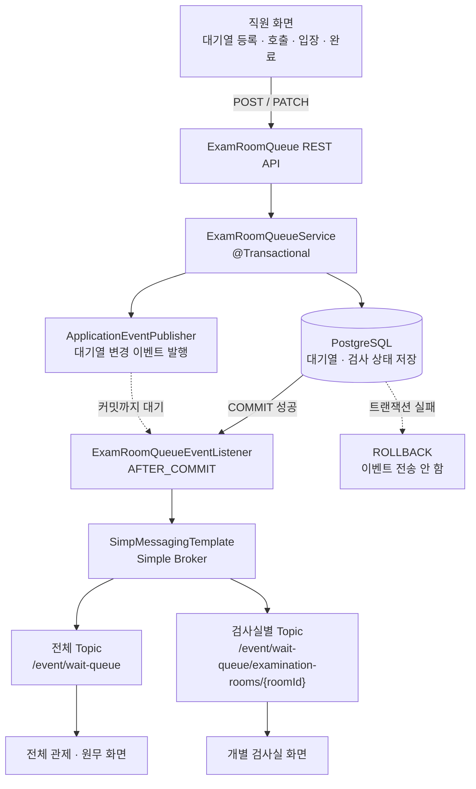
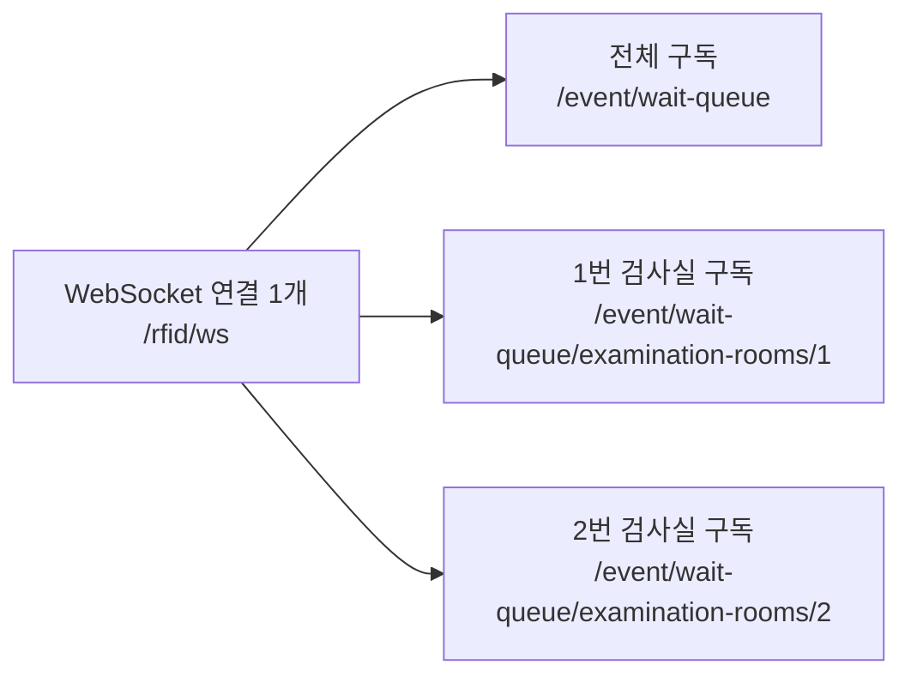

# WebSocket 대기열 이벤트 구독 구조

## 적용 목적

검사실 대기열이 등록, 호출, 입장 또는 완료될 때 화면이 목록 API를 반복 호출하지 않아도 변경 사실을 즉시 알 수 있도록 STOMP 기반 WebSocket 이벤트를 적용했습니다.

상태 변경 명령은 기존 REST API가 처리하고, WebSocket은 DB에 반영된 변경 이벤트를 구독 화면에 전달하는 역할만 담당합니다.

## 연결 및 구독 주소

| 구분 | 주소 | 구독 대상 |
| --- | --- | --- |
| WebSocket 연결 | `/rfid/ws` | 모든 WebSocket 클라이언트 |
| 전체 대기열 구독 | `/event/wait-queue` | 전체 관제 및 원무 화면 |
| 검사실별 구독 | `/event/wait-queue/examination-rooms/{examinationRoomId}` | 해당 검사실 화면 |

하나의 WebSocket 연결에서 여러 Topic을 동시에 구독할 수 있습니다. 전체 화면은 전체 Topic만 구독하고, 개별 검사실 화면은 해당 검사실 Topic만 구독해 동일 이벤트를 중복 수신하지 않도록 구성합니다.

## 이벤트 전파 흐름



## 구독 관계



Topic은 새로운 WebSocket 연결을 생성하는 주소가 아닙니다. `/rfid/ws`로 생성된 하나의 STOMP 세션 안에서 클라이언트가 필요한 Topic을 여러 개 구독합니다.

## 이벤트 종류

```text
QUEUE_CREATED
QUEUE_CALLED
QUEUE_ENTERED
QUEUE_COMPLETED
```

이벤트에는 검사실, 대기열, 환자 검사와 방문을 식별할 수 있는 값이 포함됩니다.

```json
{
  "eventType": "QUEUE_CALLED",
  "examinationRoomId": 1,
  "queueId": 15,
  "patientExamId": 7,
  "patientVisitId": 3,
  "queueNumber": 6,
  "status": "CALLED",
  "occurredAt": "2026-08-06T06:30:00Z"
}
```

## 커밋 이후 전송하는 이유

Service에서 이벤트를 발행하더라도 Listener는 `AFTER_COMMIT` 단계까지 처리를 기다립니다.

```java
@TransactionalEventListener(
        phase = TransactionPhase.AFTER_COMMIT
)
public void handle(ExamRoomQueueEvent event) {
    // 전체 Topic과 검사실별 Topic으로 전송
}
```

트랜잭션이 롤백되면 Listener가 실행되지 않으므로 DB에는 존재하지 않는 변경사항이 화면에 먼저 전달되는 문제를 방지할 수 있습니다.

현재 구조에서는 DB 커밋 이후 WebSocket 전송 자체가 실패하면 이벤트를 다시 보내지 않습니다. 대기열 화면은 목록 조회 API로 최신 상태를 복구할 수 있고 이벤트 유실의 영향이 크지 않으므로, Outbox나 외부 메시지 브로커 없이 Spring Simple Broker를 사용했습니다.

## 테스트 방법

애플리케이션 실행 후 다음 페이지에 접속합니다.

```text
http://localhost:8080/websocket-test.html
```

검사실 ID를 선택하고 연결한 다음 Swagger나 Postman에서 대기열 등록 API를 호출합니다. 전체 이벤트 영역과 해당 검사실 이벤트 영역에 같은 이벤트가 표시되면 두 구독 경로가 모두 정상적으로 동작한 것입니다.
